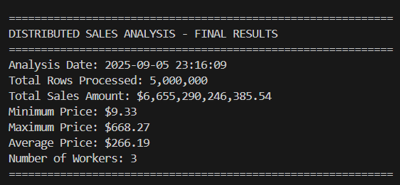

# Distributed Sales Data Analysis System

A high-performance distributed computing solution for analyzing large-scale sales datasets using multiple worker nodes communicating via TCP sockets, with SQL database aggregation for comprehensive sales insights.

## 🚀 Project Overview

This system processes a **5 million row sales dataset** by distributing the computational load across multiple worker processes, enabling efficient parallel analysis of large datasets that would be slow or memory-intensive on a single machine.

### Key Features

- **Distributed Architecture**: Master-worker pattern with TCP socket communication
- **Scalable Processing**: Handles datasets of a large size with configurable worker count
- **SQL Database Integration**: SQLite for storing partial and aggregated results
- **Real-time Progress Tracking**: Comprehensive logging and status updates
- **Persistent Reporting**: Results saved in multiple formats (console, text, JSON, csv, sqlite database)
- **Dynamic Load Balancing**: Automatic chunk sizing based on worker count

## 📊 Dataset Specifications

- **File**: `sample_sales_data.csv`
- **Size**: 5,000,000 rows
- **Columns**: Region, Country, Item Type, Sales Channel, Order Priority, Order Date, Order ID, Ship Date, Units Sold, Unit Price, Unit Cost, Total Revenue, Total Cost, Total Profit
- **Key Metrics**: Analysis focuses on `Unit Price` and `Units Sold` for sales calculations

## 🏗️ System Architecture

### Components

1. **SalesAnalysisServer (Coordinator)**
   - Loads and partitions the dataset
   - Manages TCP socket connections
   - Distributes data chunks to workers
   - Aggregates results using SQL queries
   - Generates comprehensive reports

2. **SalesAnalysisWorker (Processing Node)**
   - Connects to server via TCP sockets
   - Processes assigned data chunks
   - Computes statistical metrics
   - Returns results to coordinator

3. **DatabaseManager (Data Persistence)**
   - SQLite database for result storage
   - Handles partial result insertion
   - Performs final aggregation queries

### Data Flow

```
Dataset (5M rows) → Server → Dynamic Chunks → Workers → Partial Results → Database → Final Report
```

## 💾 Database Schema

```sql
CREATE TABLE worker_results (
    id INTEGER PRIMARY KEY AUTOINCREMENT,
    worker_id TEXT NOT NULL,
    rows_processed INTEGER NOT NULL,
    total_sales_amount REAL NOT NULL,
    min_price REAL NOT NULL,
    max_price REAL NOT NULL,
    avg_price REAL NOT NULL,
    timestamp DATETIME DEFAULT CURRENT_TIMESTAMP
);
```

## 🔧 Installation & Setup

### Prerequisites
```bash
pip install pandas numpy
```

### Files Required
- `sales_analysis.py` (main system code)
- `sample_sales_data.csv` (5M row sales dataset)

## 🚀 Usage

### Running the Distributed System

#### Step 1: Start the Server
```bash

# Start server with custom worker count
python sales_analysis.py server 3
```

#### Step 2: Start Workers (separate terminals)
```bash
# Terminal 2
python sales_analysis.py worker

# Terminal 3
python sales_analysis.py worker

# Terminal 4
python sales_analysis.py worker
```

## 📈 Computational Metrics

### Load Distribution (3 Workers)
- **Worker 1**: Rows 0 - 1,666,666 (1,666,667 rows)
- **Worker 2**: Rows 1,666,667 - 3,333,333 (1,666,667 rows)
- **Worker 3**: Rows 3,333,334 - 4,999,999 (1,666,666 rows)
- **Total**: 5,000,000 rows processed

### Performance Characteristics
- **Chunk Size**: Dynamic (dataset_size ÷ worker_count)
- **Memory Usage**: Distributed across workers
- **Network Communication**: Pickle serialization over TCP
- **Fault Tolerance**: Individual worker failure isolation

## 📊 Output of Our Code

### Terminal Output



### Generated Files

#### 1. `sales_analysis_report.txt`
Human-readable formatted report with complete analysis results.

#### 2. `sales_analysis_report.json`
Machine-readable structured data:
```json
{
    "total_rows": 5000000,
    "total_sales_amount": 6655290246385.54,
    "min_price": 9.33,
    "max_price": 668.27,
    "avg_price": 266.19,
    "num_workers": 3,
    "analysis_timestamp": "2025-09-05T23:16:09.408418",
    "dataset_file": "sample_sales_data.csv"
}
```
### 3. `sales_analysis_report.csv`
Tabular summary of metrics:

Metric,Value\
Analysis Date,2025-09-05 23:16:09\
Total Rows Processed,5000000\
Total Sales Amount,6,655,290,246,385.54\
Minimum Price,9.33\
Maximum Price,668.27\
Average Price,$266.19\
Number of Workers,3

#### 4. `sales_analysis.db`
SQLite database containing:
- Individual worker results
- Processing timestamps
- Detailed metrics for audit trail

## 🧮 Statistical Calculations

### Core Metrics
- **Total Sales Amount**: `Σ(Unit Price × Units Sold)` across all records
- **Average Unit Price**: `Σ(Unit Price) ÷ Total Records`
- **Price Range Analysis**: Min/Max unit prices across dataset
- **Weighted Averages**: Proper aggregation across distributed chunks

### Aggregation Methodology
```sql
SELECT 
    SUM(rows_processed) as total_rows,
    SUM(total_sales_amount) as total_sales,
    MIN(min_price) as global_min_price,
    MAX(max_price) as global_max_price,
    SUM(avg_price * rows_processed) / SUM(rows_processed) as weighted_avg_price,
    COUNT(*) as num_workers
FROM worker_results;
```

## 🔍 Monitoring & Debugging

### Log Analysis
All operations logged with timestamps and component identification:
```
2025-09-05 14:30:20,123 - SalesAnalysisServer - INFO - Dataset loaded: 5000000 rows, 14 columns
2025-09-05 14:30:25,456 - SalesAnalysisServer - INFO - Connected to worker_12345
2025-09-05 14:30:30,789 - SalesAnalysisWorker - INFO - Processed 1666667 rows
```

### Database Inspection
```sql
-- Check individual worker performance
SELECT worker_id, rows_processed, total_sales_amount, timestamp 
FROM worker_results 
ORDER BY timestamp;

-- Verify data integrity
SELECT SUM(rows_processed) as total_processed FROM worker_results;
```

## 📝 Conclusion

This distributed sales analysis system demonstrates enterprise-grade approaches to big data processing, combining network programming, database management, and distributed computing principles to deliver scalable analytics solutions for large datasets.

The system successfully processes 5 million sales records through parallel computation, providing comprehensive business insights while maintaining data integrity and system reliability.